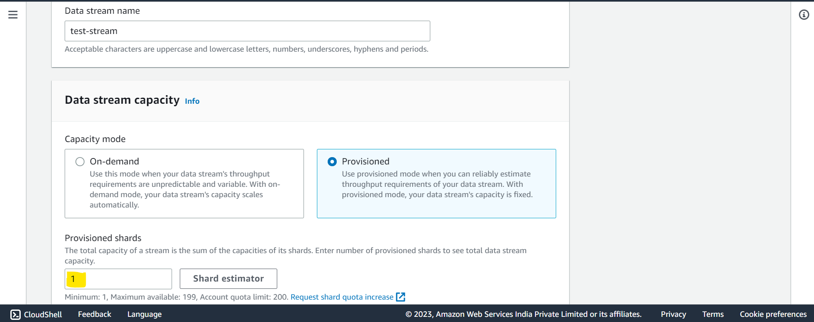
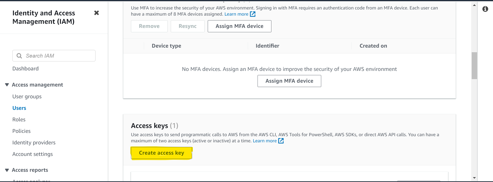

**AWS**

Open the AWS console and search of Kinesis

Select - Create data stream
Give your stream a name (test-stream) and select Provisioned and shards as 1

Now let's create an IAM used who has access to produce and read data to the created kinesis stream

Create an IAM user with the following full access
1. AmazonKinesisAnalyticsFullAccess 
2. AmazonKinesisFirehoseFullAccess 
3. AmazonKinesisFullAccess 
4. AmazonKinesisVideoStreamsFullAccess

After the user creation, select the user go to the Security Credentials tab.

Copy the credentials in a notepad for further use.

**PyCharm**

Open pycharm and create a new project.
In the pycharm terminal run the following commands - 
1. pip install -r requirements.txt
2. aws configure

Enter the credentials that we copied in the above step and specify the region

Now you can run the producer.py
This will produce sample data in your kinesis stream.

You can now run consumer.py and consume the produced messages.